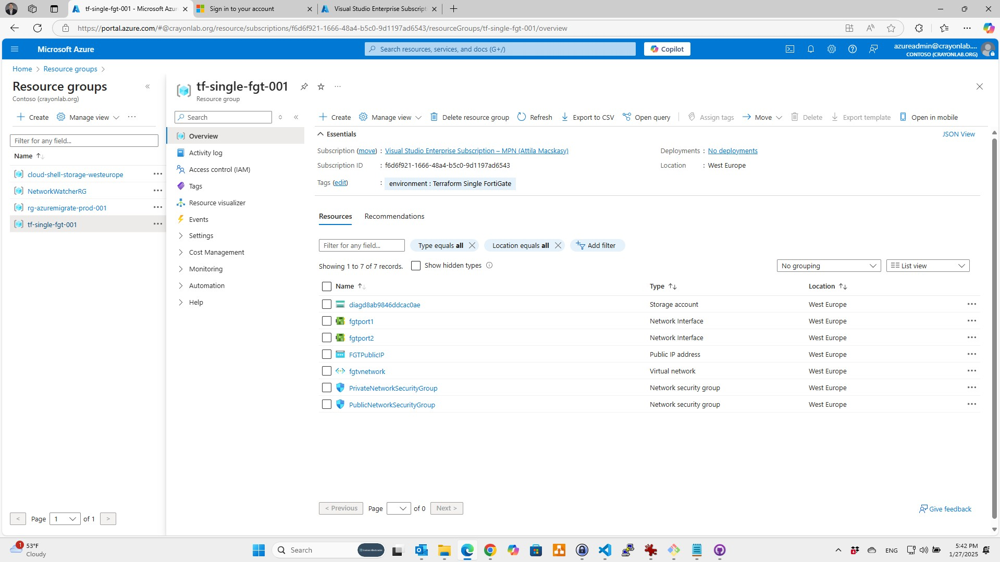

# Deployment of a FortiGate-VM(BYOL/PAYG) on Azure

## ISSUE 1: Adjusting variables.tf to align with Evaluation VM License Requirements (Standard_F4s_v2 to Standard_B1s - 1 CPU and 2 GB of memory)

I have modified the variables.tf file to change the VM size from Standard_F4s_v2 to Standard_B1s. This change ensures compliance with the limitations of the FortiGate-VM permanent evaluation license, which allows a maximum of 1 CPU and 2 GB of memory.

If you do not have a paid Fortinet license and are experimenting with deployments using the permanent evaluation VM license, you must adhere to its limitations.
Learn more here: [Permanent trial mode for FortiGate-VM](https://docs.fortinet.com/document/fortigate/7.4.7/administration-guide/441460)

```
variable "size" {
  type    = string
  //default = "Standard_F4s_v2"
  //changed due to limitations in FortiGate EVAL (Maximum of 1 CPU and 2 GB of memory) https://docs.fortinet.com/document/fortigate/7.4.7/administration-guide/441460 
  default = "Standard_B1s"
}
```

## ISSUE 2: Attila's observations on Terraform Provider API Changes (January 2025)
I have identified minor issues in the code due to updates in the Terraform provider API. The provider.tf file does not specify or enforce a required Terraform version, which led to configuration inconsistencies. These issues have been resolved to align with the latest Terraform provider requirements.

```
PS C:\Users\Attila\Desktop\Code\fortigate-terraform-deploy\azure\7.6\single> terraform plan
╷
│ Error: Missing required argument
│
│   on fgtvm.tf line 6, in resource "azurerm_image" "custom":
│    6:   os_disk {
│
│ The argument "storage_type" is required, but no definition was found.
╵
╷
│ Error: Unsupported argument
│
│   on network.tf line 138, in resource "azurerm_network_interface" "fgtport2":
│  138:   enable_ip_forwarding = true
│
│ An argument named "enable_ip_forwarding" is not expected here.
```

My solutions are below - again, probably anoter way is to lock to the last known good version of providers.

I added: storage_type = "Standard_LRS" and ip_forwarding_enabled = true

```
//fgtvm.tf line 6
resource "azurerm_image" "custom" {
  count               = var.custom ? 1 : 0
  name                = var.custom_image_name
  resource_group_name = var.custom_image_resource_group_name
  location            = var.location
  os_disk {
    os_type  = "Linux"
    os_state = "Generalized"
    blob_uri = var.customuri
    size_gb  = 2
    // The argument "storage_type" is required, but no definition was found. 
    // for reference: https://registry.terraform.io/providers/hashicorp/azurerm/latest/docs/resources/image
    // storage_type - (Required) The type of Storage Disk to use. Possible values are Premium_LRS, PremiumV2_LRS, Premium_ZRS, Standard_LRS, StandardSSD_LRS, StandardSSD_ZRS and UltraSSD_LRS. Changing this forces a new resource to be created.
    storage_type = "Standard_LRS"
  }
}

//network.tf line 138
resource "azurerm_network_interface" "fgtport2" {
  name                 = "fgtport2"
  location             = var.location
  resource_group_name  = azurerm_resource_group.myterraformgroup.name

  //enable_ip_forwarding = true
 // An argument named "enable_ip_forwarding" is not expected here.
 
  ip_forwarding_enabled = true
  // for reference: https://registry.terraform.io/providers/hashicorp/azurerm/latest/docs/resources/network_interface 
  // ip_forwarding_enabled - (Optional) Should IP Forwarding be enabled? Defaults to false.

  ip_configuration {
    name                          = "ipconfig1"
    subnet_id                     = azurerm_subnet.privatesubnet.id
    private_ip_address_allocation = "Dynamic"
  }

  tags = {
    environment = "Terraform Single FortiGate"
  }
}


```

After these minor changes "terraform plan" started to work.

## ISSUE 3: FortiGate VM Deployment Failed Due to Validation Errors
All resources were deployed successfully, except the FortiGate VM. The error indicates that the offer cannot be purchased due to validation issues.

This appears to be a new issue, potentially caused by using a different region. The default location is set to "westeurope" instead of the "westus2" region defined in variables.tf.

I will troubleshoot this issue further to identify the root cause and determine the necessary steps to resolve it.

```
PS C:\Users\Attila\Desktop\Code\fortigate-terraform-deploy\azure\7.6\single> terraform apply

Plan: 20 to add, 0 to change, 0 to destroy.

Changes to Outputs:
  + FGTPublicIP   = (known after apply)
  + Password      = "Fortinet.1234#"
  + ResourceGroup = "tf-single-fgt-001"
  + Username      = "cloudadmin"

Do you want to perform these actions?
  Terraform will perform the actions described above.
  Only 'yes' will be accepted to approve.

  Enter a value: yes

 Error: creating/updating Virtual Machine (Subscription: "f6d6f921-1666-48a4-b5c0-9d1197ad6543"
│ Resource Group Name: "tf-single-fgt-001"
│ Virtual Machine Name: "fgtvm"): performing CreateOrUpdate: unexpected status 400 (400 Bad Request) with error: ResourcePurchaseValidationFailed: User failed validation to purchase resources. Error message: 'Offer with PublisherId: 'fortinet', OfferId: 'fortinet_fortigate-vm_v5' cannot be purchased due to validation errors. For more information see details. Correlation Id: '61ff72d3-3752-b363-d763-4374600b9f20' The 'unknown' payment instrument(s) is not supported for offer with OfferId: 'fortinet_fortigate-vm_v5', PlanId 'fortinet_fg-vm_payg_2023_g2'. Correlation Id '61ff72d3-3752-b363-d763-4374600b9f20'.'
│
│   with azurerm_virtual_machine.fgtvm[0],
│   on fgtvm.tf line 76, in resource "azurerm_virtual_machine" "fgtvm":
│   76: resource "azurerm_virtual_machine" "fgtvm" {

```

Janunary 27, 2025: I am going to commit my changes to my fork and continue investigation from here.



## Introduction

A Terraform script to deploy a FortiGate-VM(BYOL/PAYG) on Azure

## Requirements

* [Terraform](https://learn.hashicorp.com/terraform/getting-started/install.html) >= 0.12.0
* Terraform Provider AzureRM >= 2.38.0
* Terraform Provider Template >= 2.2.2
* Terraform Provider Random >= 3.0.0

## Deployment overview

Terraform deploys the following components:

* Azure Virtual Network with 2 subnets
* One FortiGate-VM instances with 2 NICs
* Two firewall rules: one for external, one for internal.

## Deployment

To deploy the FortiGate-VM to Azure:

1. Clone the repository.
2. Customize variables in the `terraform.tfvars.example` and `variables.tf` file as needed.  And rename `terraform.tfvars.example` to `terraform.tfvars`.
3. Initialize the providers and modules:

   ```sh
   cd XXXXX
   terraform init
    ```

4. Submit the Terraform plan:

   ```sh
   terraform plan
   ```

5. Verify output.
6. Confirm and apply the plan:

   ```sh
   terraform apply
   ```

7. If output is satisfactory, type `yes`.

Output will include the information necessary to log in to the FortiGate-VM instances:

```sh
FGTPublicIP = <FGT Public IP>
Password = <FGT Password>
ResourceGroup = <Resource Group>
Username = <FGT Username>
```

## Destroy the instance

To destroy the instance, use the command:

```sh
terraform destroy
```

## Requirements and limitations - Attila think this needs to happen in terraform due to TF state using azurerm_marketplace_agreement

The terms for the FortiGate PAYG or BYOL image in the Azure Marketplace needs to be accepted once before usage. This is done automatically during deployment via the Azure Portal. For the Azure CLI the commands below need to be run before the first deployment in a subscription.

```sh
BYOL az vm image terms accept --publisher fortinet --offer fortinet_fortigate-vm_v5 --plan fortinet_fg-vm
PAYG az vm image terms accept --publisher fortinet --offer fortinet_fortigate-vm_v5 --plan fortinet_fg-vm_payg_2023
```

## Support

Fortinet-provided scripts in this and other GitHub projects do not fall under the regular Fortinet technical support scope and are not supported by FortiCare Support Services.
For direct issues, please refer to the [Issues](https://github.com/fortinet/fortigate-terraform-deploy/issues) tab of this GitHub project.
For other questions related to this project, contact [github@fortinet.com](mailto:github@fortinet.com).

## License

[License](https://github.com/fortinet/fortigate-terraform-deploy/blob/master/LICENSE) © Fortinet Technologies. All rights reserved.
